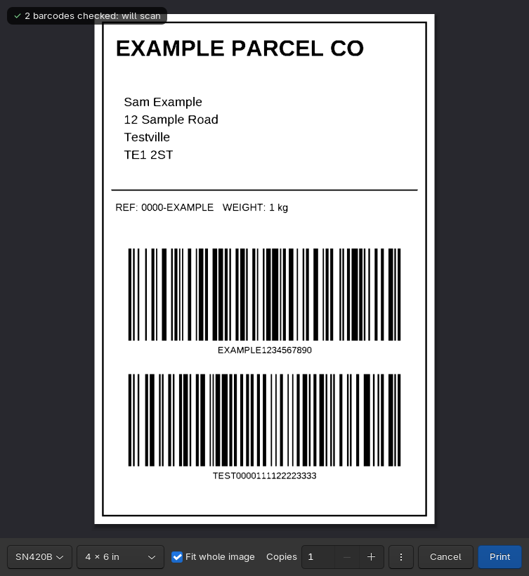
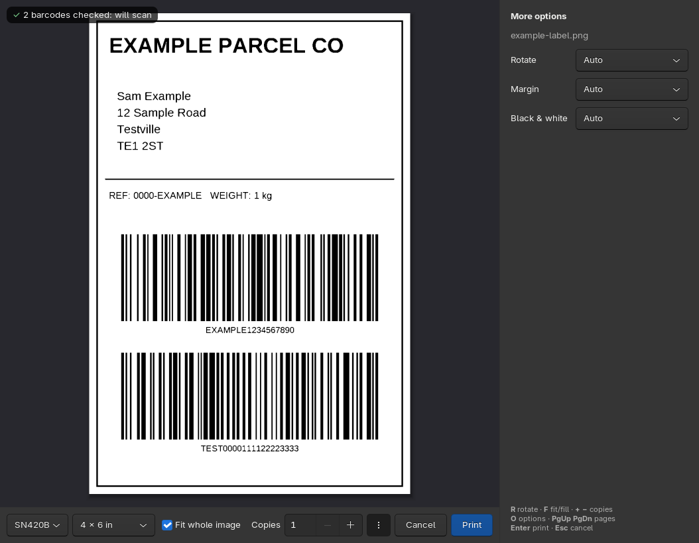
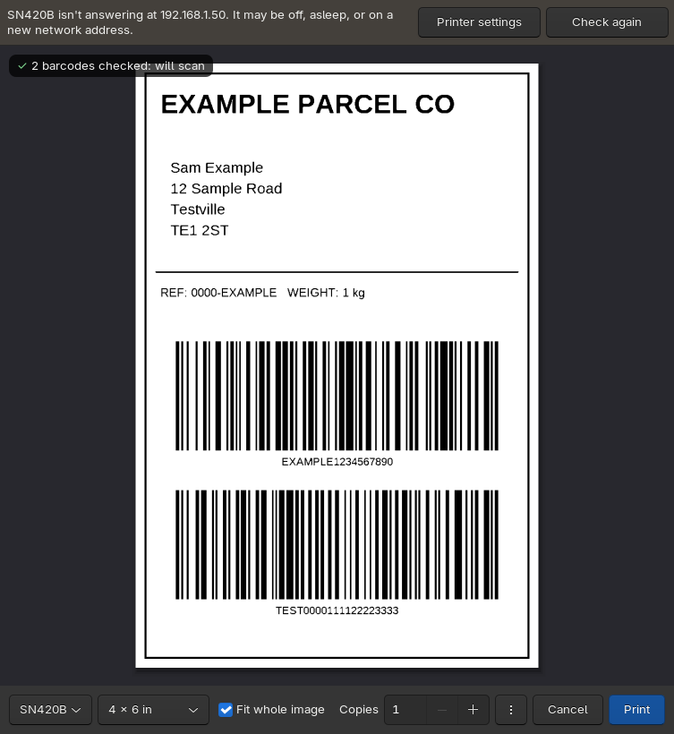

# Print preview for Omarchy

See what you're printing before you print it. Omarchy's image viewer (imv)
binds `Ctrl+P` to `lp`, which sends the image straight to the printer with no
preview and no settings. This replaces that with a small preview window, and
can also catch `Ctrl+P → Print` from every other app.



- **Images and PDFs**, including multi-page PDFs (and PostScript from older apps).
- **What you see is what prints.** Each page is drawn into a PDF at the exact
  paper size and sent with `lp -o print-scaling=none`, so the printer doesn't
  rescale it.
- **Thermal and black-only printers** (shipping label printers, mono lasers):
  the page is rendered at the printer's own dpi and turned into pure black and
  white, so the preview shows the actual dots. The tests check that the printed
  dots match the preview exactly. Each page is judged on its own: labels get a
  sharp cut-off, photos a dotted pattern.
- **Barcode check.** Shrinking a low-resolution label onto the printer's dots
  can make bars a dot too fat or thin, enough that a barcode stops scanning.
  Every barcode that reads on the page is read back from the black-and-white
  dots. If one broke, its own area gets a different black/white cut-off until it
  scans again, and a badge says so: *✓ 2 barcodes checked: will scan*, or a
  warning if one can't be saved.
- **Printer offline warning**, with a button for printer settings, or your own
  script (see below).
- One row of controls: printer, paper size (common label sizes first, the rest
  under *Other sizes…*), *Fit whole image*, copies. `⋮` opens rotate (auto, 0,
  90, 180, 270°), margin and black & white options. Remembers the last printer
  you used.



## Install

Needs Omarchy with Hyprland's Lua config (`~/.config/hypr/hyprland.lua`).

```bash
git clone https://github.com/kenners22/omarchy-print-preview ~/.local/share/omarchy-print-preview
~/.local/share/omarchy-print-preview/install.sh
```

That gives you:

| Where | What |
|---|---|
| imv | `Ctrl+P` opens the preview (a backup of `~/.config/imv/config` is kept) |
| Files | right-click an image or PDF → **Print preview…** (restart Files once: `nautilus -q`) |
| Anywhere | **Open with → Print preview** |
| Terminal | `print-preview file.png label.pdf` |

It installs `python-gobject python-cairo python-numpy poppler-glib zbar
ghostscript` if any are missing. The files are linked from the clone, so
`git pull` updates it.

### Every app's Ctrl+P (optional)

```bash
~/.local/share/omarchy-print-preview/install.sh --with-printer
```

This adds a printer called **Preview** and makes it *your* default printer
(other users are untouched). In Chromium, LibreOffice, Document Viewer and other
apps, `Ctrl+P → Print` then opens this preview, and you print to the real
printer from there. The copies and page range you picked in the app's dialog
carry over. `lp -d <printer>` still prints directly.

It won't take over a printer that's already called Preview. Only the user who
ran the install gets the preview; anyone else printing to Preview is told it
isn't set up for them, rather than the job vanishing. A job that can't be
opened is kept in `~/.local/state/print-preview/failed/` and you get a
notification.

How it works: a CUPS backend (`/usr/lib/cups/backend/print-preview`, run as
root by CUPS) saves each job into `/var/spool/print-preview/<you>/`, and a
systemd user path unit (part of the graphical session) opens it in the preview.
Job titles are cleaned before they become file names, jobs over 512 MB are
refused, and each job is moved in whole so nothing half-written is ever opened.
Read `print-preview-backend` before installing it: it's short.

The backend is a root-owned copy, so after `git pull`, run `./install.sh` again
to update it (it only asks for sudo if the backend changed).

To take just the Preview printer back out (keeping imv, Files and Open with):

```bash
~/.local/share/omarchy-print-preview/install.sh --no-printer
```

### Undo

```bash
~/.local/share/omarchy-print-preview/install.sh --undo
```

This puts back the `Ctrl+P` line imv had before (yours, or Omarchy's), your
previous default printer, and removes the window rules, links and the Preview
printer. The libraries stay installed.

## Keys

`Enter` print · `Esc` cancel · `R` rotate · `F` fit/fill · `+`/`-` copies ·
`O` more options · `Page Up`/`Page Down` pages

## Fixing a printer that went missing

When the printer doesn't answer, a bar offers **Printer settings**. If your
printer is on Wi-Fi and its address keeps changing, put a script at
`~/.config/print-preview/find-printer` and make it executable. The button then
says **Find printer** and runs it in a terminal with the printer name as its
argument, so it can rescan and repoint the queue with `lpadmin`.



## Tests

```bash
python3 tests.py
```

The tests never print. They make their own sample files. The black-and-white
and barcode tests need a black-only printer set up in CUPS, plus `zint` to
generate a barcode (`sudo pacman -S zint`).

## Notes

- Tested on Omarchy 4 (Hyprland 0.56, Lua config) with a 203 dpi 4×6 thermal
  label printer using CUPS's Zebra ZPL driver. On colour printers the page is
  redrawn as a PDF at the chosen size and placement (vector stays vector); it is
  not the app's original file, so print-specific extras like ICC profiles or
  overprint aren't carried over.
- Paper sizes come from the printer's PPD or IPP names (`A4`, `w288h432`,
  `iso_a4_210x297mm`, `na_letter_8.5x11in`, `4x6`…). If CUPS doesn't answer,
  the preview assumes an ordinary colour printer rather than guessing.
- Offline detection works for `socket://`, `ipp(s)://`, `http(s)://` and
  `lpd://` printers (IPv6 too). USB and `dnssd://` printers show no warning.
- Multi-page TIFFs show only the first page.
- The window floats centred at 760×820. Omarchy applies its slight window
  transparency before a rule can drop the tag, so the rule also sets
  `opacity = "1 1"`.
- The Preview printer has a small PPD (`print-preview.ppd`: A4, Letter, A5,
  4×6) instead of being a raw queue. Chromium's own print screen calls a raw
  queue "not available" because it lists no paper sizes. The PPD passes PDF and
  PostScript through untouched, so the preview still gets exactly what the app
  sent. CUPS 2.4 marks PPDs as deprecated but still supports them.
- To skip Chromium's print screen entirely, start Chromium with
  `--kiosk-printing` (add it to `~/.config/chromium-flags.conf`) and give it the
  policy `PrintPreviewUseSystemDefaultPrinter`. Ctrl+P, or a site's "Print
  label" button, then goes straight into this preview.

Community project, not part of Omarchy. MIT licensed.
